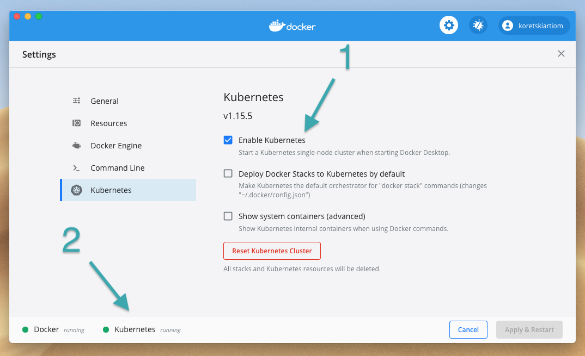

# Setting up the K8s Cluster

- [`kubectl`](#Install-kubectl)
- [`docker`](#Docker)
- [`minikube`](#Minikube)

## Install-kubectl

| Commands                           | OS                                                     |
| ---------------------------------- | ------------------------------------------------------ |
| `brew install kubectl`             | Linux and MacOS (Option1)                              |
| `snap install kubectl --classic`   | Linux and MacOS (Option2)                              |
| `choco install kubernetes-cli`     | Windows (Option1)                                      |
| `scoop install kubectl`            | Windows (Option2)                                      |
| `kubectl version --client --short` | Test to ensure the version you installed is up-to-date |

[Additional info on installing kubectl](https://kubernetes.io/docs/tasks/tools/install-kubectl/)

## Docker

| Installation Links                                                        | OS                                      |
| ------------------------------------------------------------------------- | --------------------------------------- |
| [docker-for-mac](https://docs.docker.com/docker-for-mac/install/)         | Linux and MacOS                         |
| [docker-for-windows](https://docs.docker.com/docker-for-windows/install/) | Windows                                 |
| `docker version`                                                          | Test docker from terminal               |
| About Docker Desktop                                                      | Test docker from the Docker Desktop App |

Enable Kubernetes on Docker ( only if you're not using Minikube)

## Minikube (Optional)

### Express Installation

| Installation Command     | OS                         |
| ------------------------ | -------------------------- |
| `brew install minikube`  | Linux and MacOS            |
| `choco install minikube` | Windows                    |
| `minikube version`       | Test minikube installation |

[Custom Installation](https://kubernetes.io/docs/tasks/tools/install-minikube/)

### Minikube Commands

| Commands                                                                | Description                                                                                                                                                                                                  |
| ----------------------------------------------------------------------- | ------------------------------------------------------------------------------------------------------------------------------------------------------------------------------------------------------------ |
| `minikube start --driver=docker --kubernetes-version v1.18.0 --nodes 2` | Start a cluster using the docker driver with the specified kubernetes version and 2 nodes. [Additional VM drivers](https://kubernetes.io/docs/setup/learning-environment/minikube/#specifying-the-vm-driver) |
| `minikube stop`                                                         | Stop the local cluster                                                                                                                                                                                       |
| `minikube delete`                                                       | Delete the local cluster                                                                                                                                                                                     |
| `eval $(minikube docker-env)`                                           | Reuse the Docker daemon inside the VM                                                                                                                                                                        |
